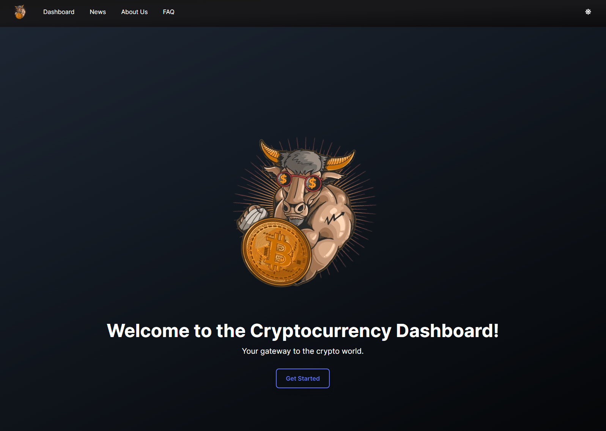
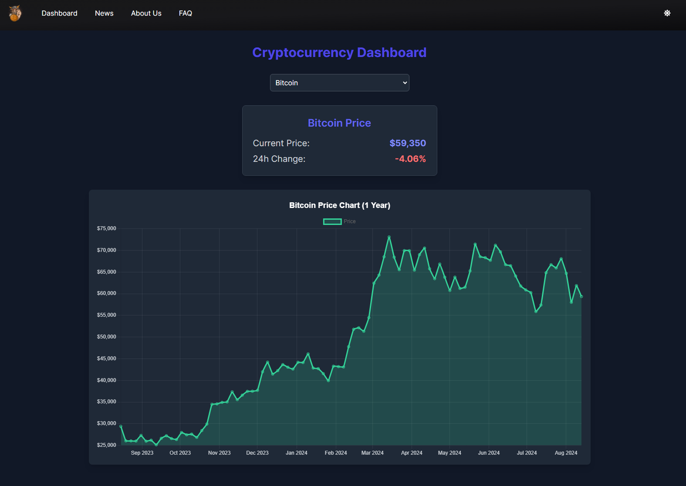
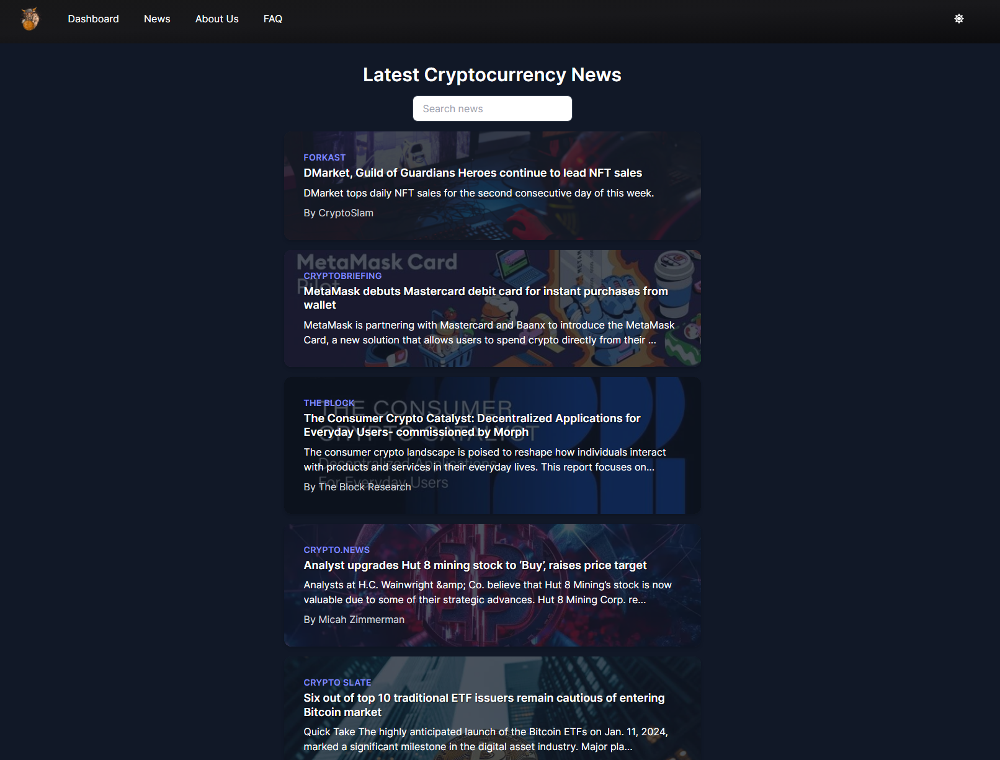
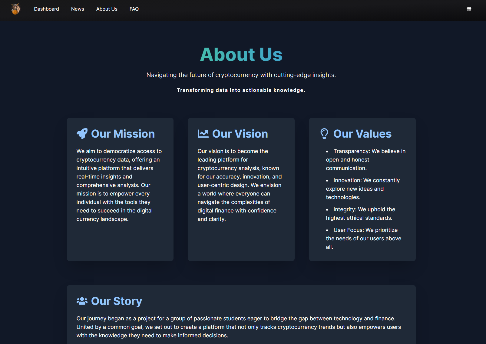
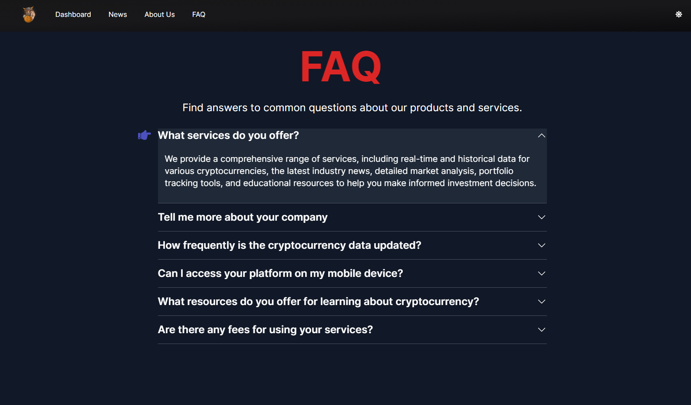

# Cryptocurrency Dashboard Project

## Table of Contents

- [Overview](#overview)
- [Live Demo](#live-demo)
- [Features](#features)
- [Getting Started](#getting-started)
- [Screenshots](#screenshots)
  - [Home](#home)
  - [Dashboard](#dashboard)
  - [News](#news)
  - [About Us](#about-us)
  - [FAQ](#faq)
- [Team](#team)
- [Contributing](#contributing)
- [License](#license)

## Overview

This project is a Cryptocurrency Dashboard built with React and Tailwind CSS. It provides historical data for the past year using MTW API, live updates, and news from the CoinGecko API. The website also includes an About Us page and a simple FAQ section.

## Live Demo

Check out the live demo of the project: [Cryptocurrency Dashboard](https://crypto-dashboard-silk-ten.vercel.app/)

## Features

- Historical cryptocurrency data for the past year
- Live updates on cryptocurrency prices
- Live news feed from CoinGecko API
- About Us page
- FAQ section

## Getting Started

This project was generated using `npx create-tw@latest`. To get started:

1. Clone the repository: `git clone https://github.com/Ataba29/Crypto-Dashboard.git`
2. cd into the project folder: `cd Cryptocurrency-Dashboard-Project`
3. Install dependencies: `npm install`
4. Run the development server: `npm run dev`

## Screenshots

### Home

_Our cryptocurrency dashboard homepage has the ability to click on "Get Started" to enter the dashboard_

### Dashboard

_Main dashboard with cryptocurrency data and trends. Users can switch between cryptocurrencies and view live data using MTW API_

### News

_Latest cryptocurrency news from CoinGecko API. Users can use the filter option to get preferred news_

### About Us

_Learn more about our team and project, and get to know us and our location_

### FAQ

_Frequently asked questions about our dashboard_

## Team

Connect with our team members on LinkedIn:

- [Ahmad Ataba](https://www.linkedin.com/in/ahmadataba/)
- [Mnsor Khalel](https://www.linkedin.com/in/mnsor-khalel-128535273/)
- [Basel Haddad](https://www.linkedin.com/in/basel-haddad-b49924315/)
- [Ibraheem Jramnh](https://www.linkedin.com/in/ibraheem-jr-b9ba86278/)

## Contributing

Please note that contributions to this project are currently closed.

## License

This project is a college assignment and is not licensed for distribution or use outside of educational purposes. All rights are reserved by the project creators. Please contact the team members for any inquiries regarding the use of this code.
